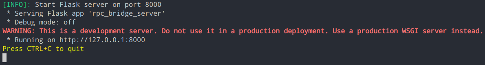
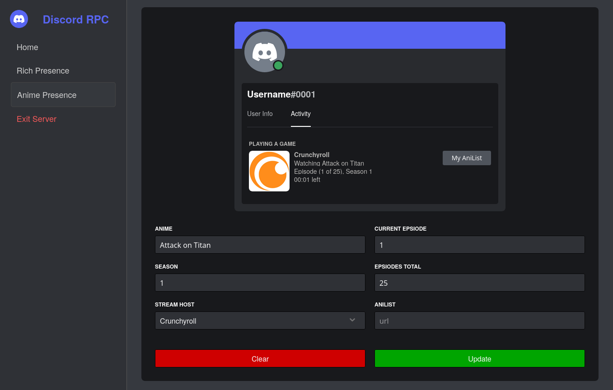
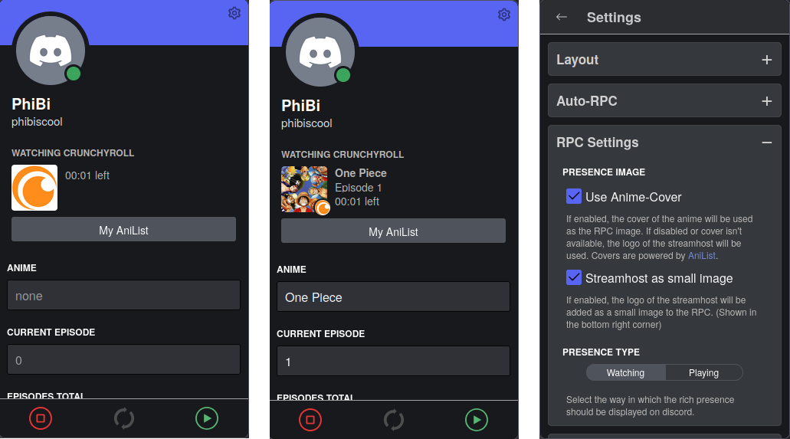

# Anime Discord RPC

[](https://www.python.org/)
[](https://mypy-lang.org/)
[](https://github.com/astral-sh/ruff)
[](https://opensource.org/licenses/MPL-2.0)

Show everyone on discord which anime you are watching with just a few clicks and a few buttons. With an optional browser add-on, you have the option of automatically recognising what you are currently viewing*.

*\*Due to discord-side limitations, the browser addon cannot run on its own and still requires the local server as a bridge device. Read more about it in [how it works](#how-it-works).*

## Build using

[](https://github.com/pallets/flask)
[](https://github.com/qwertyquerty/pypresence)
[](https://github.com/AniList/ApiV2-GraphQL-Docs)
[](https://github.com/Python-Markdown/markdown)

## Features

- [x] Set your anime progress as discord rich presence (RPC) *(See [set your presence](#set-your-presence) for value options)*
- [x] Selection of multiple streaming hosters *(See [supported hosters](#currently-supported-stream-hoster))*
- [x] Choose between `Watching` and `Playing` as activity type *(See [set your presence](#set-your-presence) for more details)*
- [x] Get cover images for the current anime, set as large image of the presence (Images by [AniList](https://anilist.co/))
- [x] Use the Firefox-Addon including all of the above functionality in an easy to use way directly within you browser and with some extra functionality like automatically recognition of current anime streams you watch *(See [Advantages of the firefox addon](#advantages-of-the-firefox-addon) to learn more)*

## Installation

First of all you need to setup the local server. The server includes the rich presence connection pipe to discord and a webpage to easily start, edit and stop your rich presence. Read the section about [how it works](#how-it-works) for more detailed information.

### Install packed server executable

To get the server in one executable file, go to the [release tab](https://github.com/Revox179/Anime-Discord-RPC/releases/latest) and download the file that fits your system:

- Windows: `rpc_bridge_server.exe`
- Linux: `rpc_bridge_server`

After downloading just double click the file to start it. If all succeed, you should be able to visit [http://127.0.0.1:8000](http://127.0.0.1:8000) in your browser of choice and start your rich presence.

See [troubleshoot](#troubleshoot) if you can't get the server running or your rpc won't start.

### Install and run server from source

If you want to run the server from source, you can do this by either downloading the whole project source code or downloading only [`Server_SourceCode.zip`](https://github.com/Revox179/Anime-Discord-RPC/releases/latest/download/DCM_flask-server) and unzip the file. Go to the root directory of the project and install the required python libaries by typing into your terminal:

```sh
python3 -m pip install -r requirements.txt
```

*Note: you need at least [python version 3.8](https://www.python.org/downloads/release/python-380/) or [higher](https://www.python.org/downloads/) installed to run this.*

If all is successfully installed you can start the server by typing the following into you terminal prompt:

```sh
python3 rpc_bridge_server.py
```

If everything runs properly, you should get the following output, indicating that the server has been started successfully:



You can now go to [http://127.0.0.1:8000](http://127.0.0.1:8000) in your browser of choice and start your rich presence.

See [troubleshoot](#troubleshoot) if you encounter any problems.

### Install additional Firefox-AddOn

This step is optional but offers some useful features like automatic recognition if you watch anime in your browser. See [Advantages of the Firefox addon](#advantages-of-the-firefox-addon).

You can download the addon from official extension hub of Firefox: [https://addons.mozilla.org/en-US/firefox/addon/anime-rpc/](https://addons.mozilla.org/en-US/firefox/addon/anime-rpc/)

*Currently only Firefox is supported. Perhaps support for Chrome or Chrome-based browsers will come too, but there is no guarantee.*

## Set your presence

If you have installed and started the server probably you should find the "Anime Presence" tab at [http://127.0.0.1:8000](http://127.0.0.1:8000).

Here you can specify the following values:

- Anime name
- Current episode
- Total episodes
- Season
- AniList link
- Stream-Hoster

You need to provide at least the anime name or current episode or season number.

Beside these values you also have some options to make:

- Use a custom cover image of the anime as rpc logo instead of the stream host logo
  - If custom cover is enabled, you can set the stream host logo as small image (displayed in the bottom right corner of the rpc logo/large image)
- Choose between `Playing` and `Watching` as Activity Type

You can view all the settings you make directly in the Live RPC preview:



### Currently Supported Stream-Hoster

- [Crunchyroll](https://www.crunchyroll.com/)
- [AniWorld](https://aniworld.to/) (Use at own risk)

Coming soon:

- [Amazon Prime Video](https://www.amazon.com/gp/video/storefront)
- [YouTube](https://www.youtube.com/)
- [Netflix](https://www.netflix.com/)

If you want support for other hosters, feel free to create an feature request in the [issue](https://github.com/Revox179/Anime-Discord-RPC/issues) tab of this repository.

## Advantages of the Firefox addon

If you have [installed](#install-additional-firefox-addon) the addon, you can open the extension popup by clicking on the addon within the extension icon of the browser bar:


> *Tip: You can permanently add the extension's pop-up icon to your browser bar by selecting the gear icon next to the extension (see image above) and activating ‘Pin to Toolbar’.*

After opening the addon you should get a live rich presence preview where you can change the values below of it and a bunch of options in the settings tab (open it by clicking the gear icon in the top right corner):



Beside the live preview with the input fields to change it you may already found the option of auto rpc in the settings. This means the automatically detection of what you're watching.

In detail, if you open for example [crunchyroll.com](https://www.crunchyroll.com) and start watching anime there, the addon should automatically recognise this and start the rich presence with the values of the anime you are watching.

You can disable this behaviour by going to `Extension Popup` > `Settings` > `Auto-RPC` and disable the option `Enable Auto RPC`. You also have the option to disable, that the addon should use the stream host you are watching on right now. It will use the selected stream host from the extension popup instead.

In the extension pop-up, you will also notice the 3 buttons at the bottom. The red left button stops the current rich presence (regardless of whether it comes from auto rpc or was started manually). With the middle button you can synchronise your rich presence values in the popup with the current data of the automatic rich presence. Use the green right button to start your rich presence with the values you have specified.

In most cases the addon will give you an error message if something is wrong, see [error messages](#error-messages).

## Error messages

The following table include known error messages and describes why they appear. If this does not solve the problem for you, feel free to create a [bug report](https://github.com/Revox179/Anime-Discord-RPC/issues/new/choose).

Error | Meaning
--- | ---
**`ERROR LOADING COVER`** | This message appears if you have enabled `Use Cover-Image` in the 'RPC Settings' tab and the addon fails to load a cover image for your current anime. This could be due to an internet connection issue or because no cover image is available for the specified anime name.
**`STORAGE ERROR`** | This error appears when there is an issue with the extension storage, such as when the values for your rich presence cannot be saved or loaded correctly.
**`NO DATA AVAILABLE`** | This error occurs when you attempt to synchronize your rich presence values in the popup with the latest automatic rich presence data, but no data is found. This might happen if you haven't watched anime on any of the [supported streaming hosts](#currently-supported-stream-hoster) since installing the addon.
**`REQUESTING SERVER FAILED`** | The server could not be reached. This is usually because the server is not running. If you start the server again it should work. You can check the server status in the extension settings tab at the `Server` section.
**`INVALID REQUEST`** | This error occurs when the server responds with something unexpected, which usually shouldn't happen. If you encounter this error, please create a [bug report](https://github.com/Revox179/Anime-Discord-RPC/issues/new/choose).
**`INTERNAL SERVER ERROR`** | This error indicates that the server is reachable, but an internal issue has occurred. This may be due to incorrect values being entered or Discord being inaccessible.

## How it Works

The project consists of two main parts. The first, and most important, is the rpc bridge server. This is a simple python script, starting a local server using [Flask](https://flask.palletsprojects.com/en/2.3.x/) at the adress `localhost:8000` to provide a GUI to enter your values. It then uses [pypresence](https://github.com/qwertyquerty/pypresence) to communicate with the discord gateway and start, update or stop your rich presence.

> *Hint: The server is only running locally on your device and is not reachable from where other then your device.*

If the server could be started, the address should be accessible in the browser and the start page with the documentation should appear. There are also other pages available. Among others, `localhost:8000/rpc`, which is a feature not yet implemented, but above all the route `http://localhost:8000/rpc_anime`.

Under this route, various options are now available to set and start your individual display for anime, as well as to stop it.
While you are making settings or changing values, you will see a preview how the result will look (see [Set your presence](#set-your-presence)).

The AddOn also requires this server. The reason is that in order to initiate Discord Rich Presence, it must communicate with the Discord IPC gateway. This is only possible if the Discord app is running locally and can directly connect to the gateway. Currently, Discord does not allow starting RPC through the browser. This means that if you're using Discord in the browser, there is no IPC gateway to communicate with, and the browser cannot interact with the local Discord gateway (because, for security reasons, browsers do not allow communication with locally running processes). Therefore, a local web server is needed to act as a "bridge" to the Discord gateway.

## Troubleshoot

***My server won't start?***

In case your server wont start and you use the executable file, try starting it using the command line to get more details, what is going wrong. Run this command inside the folder where your executable is located:

```sh
# Linux
./rpc_bridge_server

# Windows
start rpc_bridge_server.exe
```

---

***My server is running, but it gives me an error response when trying to start the presence?***

If you get an error message when starting/updating your presence, take a look at the table in [error messages](#error-messages) for more informations.

---

***The anilist button does'nt show up in my discord profile?***

This is a known bug of discord. The button is actually there and others will see it, expect your self. Try asking a friend if he can see it. If he also can't see it feel free to create a [bug report](https://github.com/Revox179/Anime-Discord-RPC/issues/new/choose).

---

Still have problems? Feel free to create a [bug report](https://github.com/Revox179/Anime-Discord-RPC/issues/new/choose).
